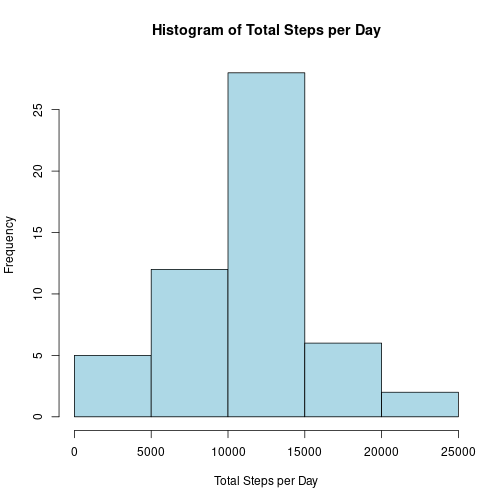
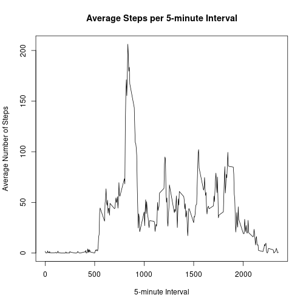
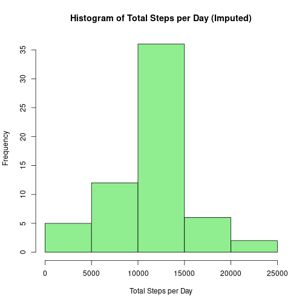
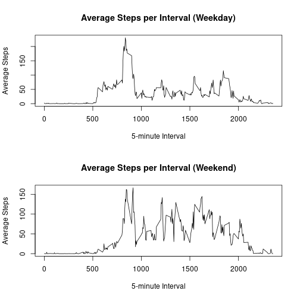

## Loading and preprocessing the data


```r
data <- read.csv("../data/activity.csv")
head(data)
```

```
##   steps       date interval
## 1    NA 2012-10-01        0
## 2    NA 2012-10-01        5
## 3    NA 2012-10-01       10
## 4    NA 2012-10-01       15
## 5    NA 2012-10-01       20
## 6    NA 2012-10-01       25
```

```r
str(data)
```

```
## 'data.frame':	17568 obs. of  3 variables:
##  $ steps   : int  NA NA NA NA NA NA NA NA NA NA ...
##  $ date    : chr  "2012-10-01" "2012-10-01" "2012-10-01" "2012-10-01" ...
##  $ interval: int  0 5 10 15 20 25 30 35 40 45 ...
```

```r
summary(data)
```

```
##      steps            date              interval     
##  Min.   :  0.00   Length:17568       Min.   :   0.0  
##  1st Qu.:  0.00   Class :character   1st Qu.: 588.8  
##  Median :  0.00   Mode  :character   Median :1177.5  
##  Mean   : 37.38                      Mean   :1177.5  
##  3rd Qu.: 12.00                      3rd Qu.:1766.2  
##  Max.   :806.00                      Max.   :2355.0  
##  NA's   :2304
```

---

## What is mean total number of steps taken per day?


```r
# Remove NA values
data_no_na <- data[!is.na(data$steps), ]

# Calculate total steps per day
total_steps_per_day <- aggregate(steps ~ date, data = data_no_na, sum)

# Histogram
hist(total_steps_per_day$steps,
     main = "Histogram of Total Steps per Day",
     xlab = "Total Steps per Day",
     col = "lightblue")
```



```r
# Mean and Median
mean_steps <- mean(total_steps_per_day$steps)
median_steps <- median(total_steps_per_day$steps)

mean_steps
```

```
## [1] 10766.19
```

```r
median_steps
```

```
## [1] 10765
```

---

## What is the average daily activity pattern?


```r
# Remove NA values
data_no_na <- data[!is.na(data$steps), ]

# Calculate average steps per interval
avg_steps_interval <- aggregate(steps ~ interval, 
                                data = data_no_na, 
                                mean)

# Time series plot
plot(avg_steps_interval$interval,
     avg_steps_interval$steps,
     type = "l",
     main = "Average Steps per 5-minute Interval",
     xlab = "5-minute Interval",
     ylab = "Average Number of Steps")
```



```r
# Find interval with maximum average steps
max_interval <- avg_steps_interval[which.max(avg_steps_interval$steps), ]

max_interval
```

```
##     interval    steps
## 104      835 206.1698
```

---

## Imputing missing values


```r
# Count total NA values
total_na <- sum(is.na(data$steps))
total_na
```

```
## [1] 2304
```

```r
# Create dataset for imputation
data_imputed <- data

# Calculate mean for each interval
interval_means <- aggregate(steps ~ interval,
                            data = data,
                            mean,
                            na.rm = TRUE)

# Replace NA with interval mean
for (i in 1:nrow(data_imputed)) {
  if (is.na(data_imputed$steps[i])) {
    interval_value <- data_imputed$interval[i]
    data_imputed$steps[i] <- interval_means$steps[
      interval_means$interval == interval_value
    ]
  }
}

# Calculate total steps per day (imputed data)
total_steps_imputed <- aggregate(steps ~ date,
                                 data = data_imputed,
                                 sum)

# Histogram after imputation
hist(total_steps_imputed$steps,
     main = "Histogram of Total Steps per Day (Imputed)",
     xlab = "Total Steps per Day",
     col = "lightgreen")
```



```r
# Mean and median after imputation
mean_imputed <- mean(total_steps_imputed$steps)
median_imputed <- median(total_steps_imputed$steps)

mean_imputed
```

```
## [1] 10766.19
```

```r
median_imputed
```

```
## [1] 10766.19
```

---

## Are there differences in activity patterns between weekdays and weekends?


```r
# Convert date to Date format
data_imputed$date <- as.Date(data_imputed$date)

# Create weekday/weekend variable
data_imputed$day_type <- ifelse(weekdays(data_imputed$date) %in% 
                                  c("Saturday", "Sunday"),
                                "weekend",
                                "weekday")

data_imputed$day_type <- as.factor(data_imputed$day_type)

# Average steps per interval by day type
avg_steps_daytype <- aggregate(steps ~ interval + day_type,
                               data = data_imputed,
                               mean)

# Separate weekday and weekend data
weekday_data <- avg_steps_daytype[avg_steps_daytype$day_type == "weekday", ]
weekend_data <- avg_steps_daytype[avg_steps_daytype$day_type == "weekend", ]

# Create panel plot
par(mfrow = c(2,1))

plot(weekday_data$interval,
     weekday_data$steps,
     type = "l",
     main = "Average Steps per Interval (Weekday)",
     xlab = "5-minute Interval",
     ylab = "Average Steps")

plot(weekend_data$interval,
     weekend_data$steps,
     type = "l",
     main = "Average Steps per Interval (Weekend)",
     xlab = "5-minute Interval",
     ylab = "Average Steps")
```



```r
par(mfrow = c(1,1))
```
